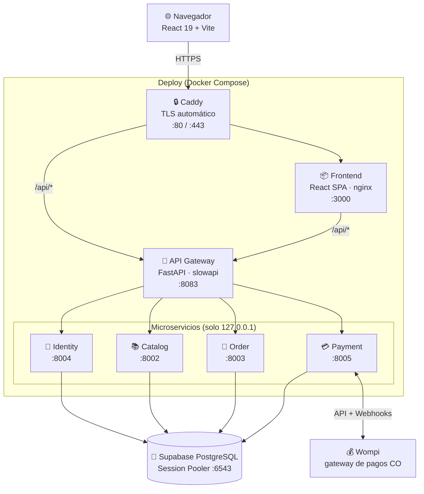
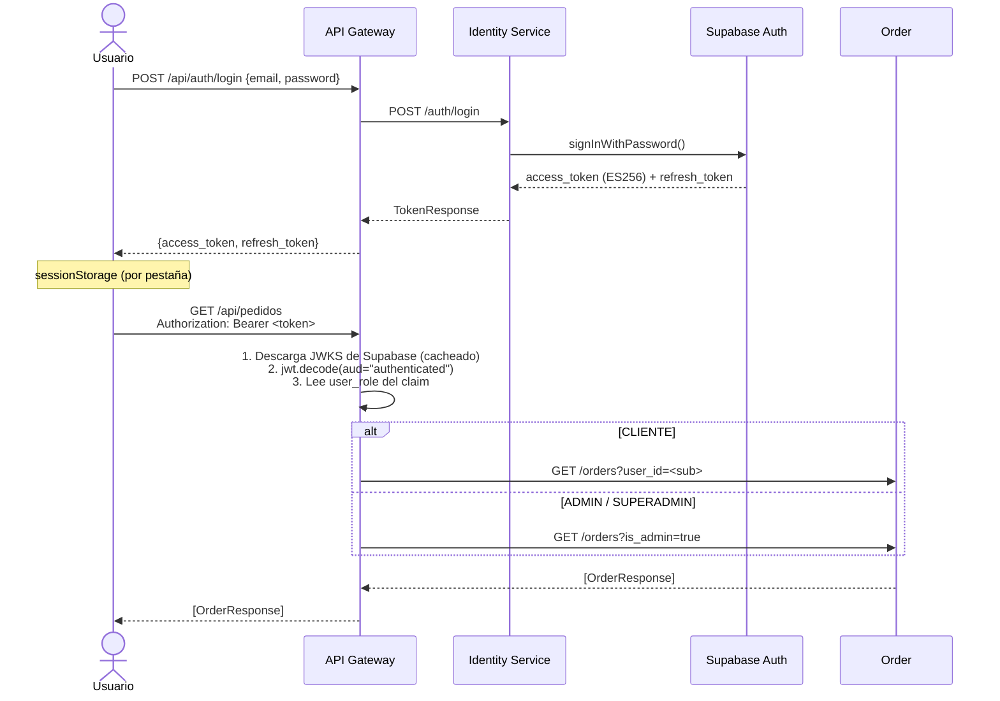
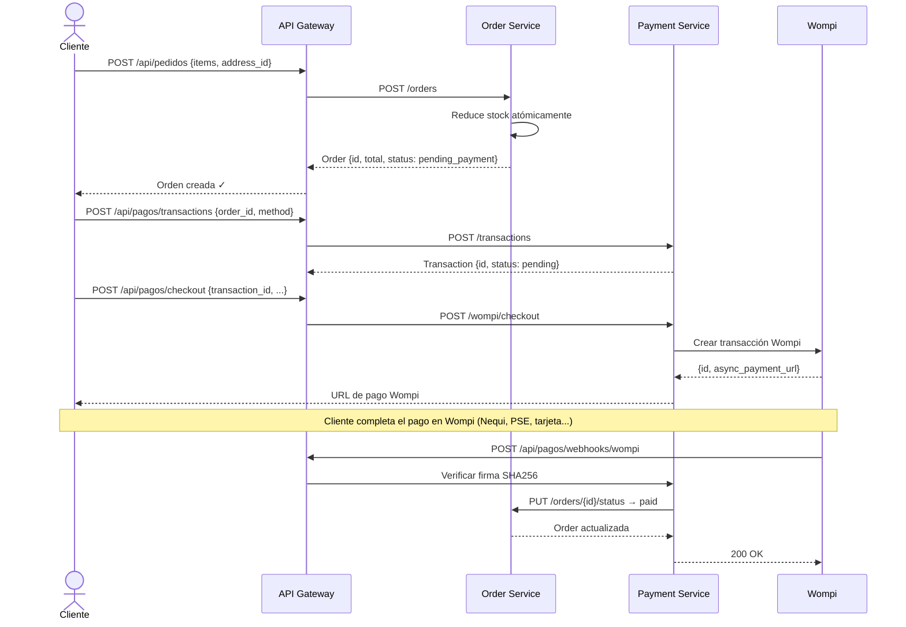
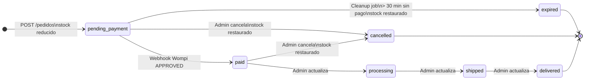
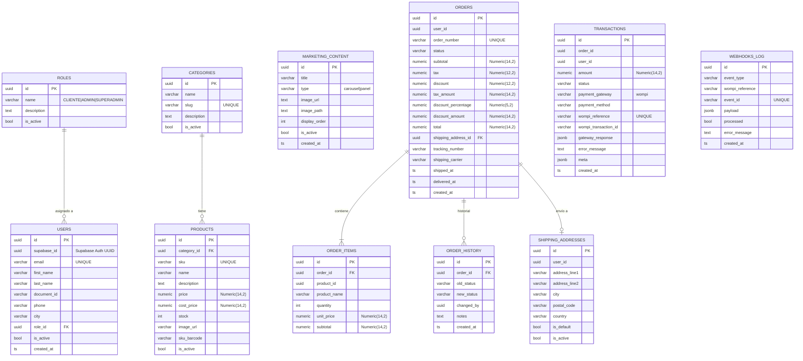
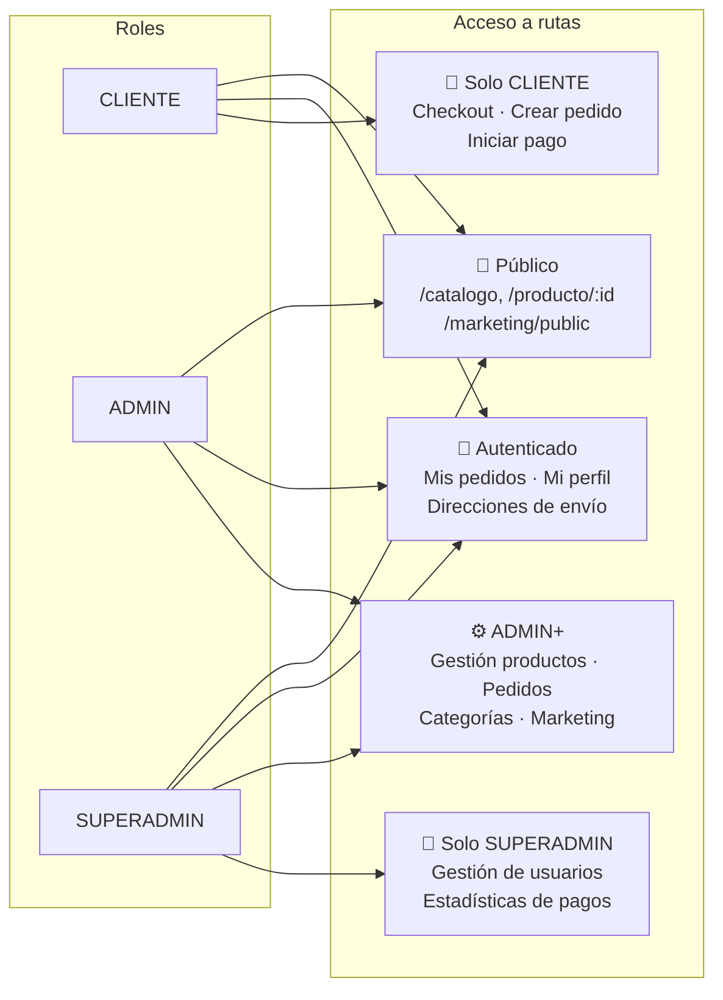

# Papelería Boyacá v2

E-commerce colombiano para papelería y útiles escolares. Arquitectura de microservicios con FastAPI + React 19, pagos reales vía Wompi.

---

## Arquitectura general



> Todos los servicios internos solo son accesibles dentro de la red Docker. El tráfico externo entra únicamente por Caddy (producción) o directamente al Gateway/Frontend en desarrollo local.

---

## Stack

| Capa | Tecnología |
|---|---|
| Frontend | React 19, Vite 8, TypeScript, TanStack Query v5, Zustand v5, Tailwind CSS v4 |
| Backend | FastAPI, SQLAlchemy async, Pydantic v2, pydantic-settings |
| Auth | Supabase Auth — ES256 JWT (ECDSA P-256) con fallback HS256 |
| Base de datos | Supabase PostgreSQL (Session Pooler puerto 6543) |
| Pagos | Wompi (Colombia) |
| Deploy | Docker Compose + Caddy TLS automático |
| Tests | pytest + pytest-asyncio — 184 tests (unitarios e integración) |

---

## Flujo de autenticación JWT



**Claims relevantes del JWT:**

| Claim | Valor |
|---|---|
| `sub` | UUID del usuario |
| `user_role` | `CLIENTE` \| `ADMIN` \| `SUPERADMIN` |
| `aud` | `"authenticated"` (requerido por el gateway) |
| `email` | Email del usuario |

---

## Flujo de pago (Wompi 2 pasos)



**Firma del webhook:**
```
signature = SHA256(concat(prop_values) + timestamp + WOMPI_EVENTS_SECRET)
```
donde `prop_values` son los campos definidos en `event.signature.properties`, concatenados en orden.

---

## Ciclo de vida de una orden



> El **cleanup job** del Order Service corre cada 5 minutos (configurable). Expira órdenes `pending_payment` con más de 30 minutos sin pago y restaura el stock.

---

## Esquema de base de datos

Cada servicio tiene su propio schema aislado en el mismo cluster de Supabase.



---

## Roles y control de acceso



> ADMIN y SUPERADMIN **no pueden** crear órdenes ni iniciar pagos — el gateway aplica `require_client_only` en esas rutas.

---

## Estructura del proyecto

```
papeleriav2/
│
├── api-gateway/                 # Punto de entrada — auth, routing, rate limiting
│   └── src/interfaces/http.py   # 38 rutas proxy + validación JWT
│
├── identity-service/            # Auth vía Supabase, usuarios, roles
├── catalog-service/             # Productos, categorías, stock, marketing
├── order-service/               # Pedidos, ítems, direcciones, cleanup job
├── payment-service/             # Transacciones Wompi, webhooks
│
├── frontend/                    # React 19 SPA → nginx:alpine en producción
│   └── src/
│       ├── pages/               # catalog/ auth/ checkout/ orders/ profile/ admin/
│       ├── components/          # layout/ ui/ (ProductCard, HeroCarousel, PromoPanels…)
│       ├── services/            # Wrappers axios: auth, catalog, orders, payments, admin
│       ├── store/               # authStore (sessionStorage), cartStore (localStorage)
│       └── lib/                 # axios.ts, utils.ts, passwordRules.ts
│
├── deploy/
│   ├── docker-compose.yml
│   ├── Caddyfile                # TLS automático (perfil --profile caddy)
│   └── .env                    # ← credenciales (gitignored)
│
├── tests_integration/           # Tests contra PostgreSQL real (:5433)
├── tests_smoke/                 # Tests contra el stack completo levantado
├── schema.sql                   # DDL inicial (4 schemas PostgreSQL)
└── Makefile
```

Cada microservicio sigue **arquitectura hexagonal** con 4 capas:

```
src/
  domain/          # Entidades y reglas de negocio (sin FastAPI, sin SQLAlchemy)
  application/     # Casos de uso + DTOs Pydantic
  infrastructure/  # Modelos SQLAlchemy, repositorios, clientes HTTP internos
  interfaces/      # Router FastAPI (http.py)
```

---

## Instalación y despliegue

### Requisitos

- Docker + Docker Compose v2
- (Opcional para desarrollo) Node.js 20 + pnpm 10, Python 3.11

### 1. Variables de entorno

Crea `deploy/.env`:

```env
# Base de datos — usar Session Pooler de Supabase (puerto 6543, NO 5432)
DATABASE_URL=postgresql+asyncpg://postgres.<ref>:<password>@aws-0-us-east-1.pooler.supabase.com:6543/postgres

# Supabase
SUPABASE_URL=https://<ref>.supabase.co
SUPABASE_KEY=<service_role_key>
SUPABASE_JWT_SECRET=<jwt_secret>

# Wompi (sandbox por defecto — cambiar a false + llaves reales para producción)
WOMPI_PUBLIC_KEY=pub_test_...
WOMPI_PRIVATE_KEY=prv_test_...
WOMPI_EVENTS_SECRET=<events_secret>
WOMPI_INTEGRITY_SECRET=<integrity_secret>
WOMPI_TEST_MODE=true

# Seguridad interna entre servicios
INTERNAL_API_SECRET=<hex_aleatorio_64_chars>

# URLs públicas (para webhooks y redirecciones de Wompi)
APP_URL=https://tudominio.com
FRONTEND_URL=https://tudominio.com
```

| Variable | Dónde conseguirla |
|---|---|
| `SUPABASE_*` | Supabase → Project Settings → API |
| `DATABASE_URL` | Supabase → Project Settings → Database → Session Pooler |
| `WOMPI_*` | [Dashboard Wompi](https://comercios.wompi.co) → Desarrolladores |

### 2. Email transaccional (Resend)

Configura SMTP en **Supabase → Project Settings → Authentication → SMTP Settings**:

```
Host:     smtp.resend.com
Port:     465
User:     resend
Password: re_xxxxxxxxxxxxxxxxxx   ← API key de resend.com
Sender:   Papelería Boyacá <noreply@mail.tudominio.com>
```

Correos que se envían automáticamente:
- **Confirmación de cuenta** al registrarse
- **Recuperación de contraseña** al solicitar reset
- **Notificación de cambio de contraseña**

### 3. Storage en Supabase

Crea dos buckets **públicos** en Supabase → Storage:

| Bucket | Para qué |
|---|---|
| `product-images` | Imágenes de productos |
| `marketing` | Banners del carrusel y paneles de la home |

### 4. Levantar

```bash
# Con Make (recomendado — reconstruye sin caché)
make start

# O directamente
docker compose -f deploy/docker-compose.yml --env-file deploy/.env build --no-cache
docker compose -f deploy/docker-compose.yml --env-file deploy/.env up -d

# Con Caddy y dominio propio (TLS automático)
APP_DOMAIN=tudominio.com docker compose -f deploy/docker-compose.yml \
  --env-file deploy/.env --profile caddy up -d
```

### Comandos útiles

```bash
make start       # Rebuild sin caché + up
make stop        # down
make restart     # stop + start
make logs        # logs -f (todos los servicios)

# Rebuild de un solo servicio
docker compose -f deploy/docker-compose.yml --env-file deploy/.env \
  up -d --build catalog-service
```

### Puertos locales

| Servicio | Puerto |
|---|---|
| Frontend | http://localhost:3000 |
| API Gateway + Swagger | http://localhost:8083 / http://localhost:8083/docs |
| Catalog Service | http://localhost:8002 |
| Order Service | http://localhost:8003 |
| Identity Service | http://localhost:8004 |
| Payment Service | http://localhost:8005 |

---

## API — referencia de rutas

Todas las rutas van a través del gateway: `http://localhost:8083/api/...`

### Auth e identidad
| Método | Ruta | Auth | Descripción |
|---|---|---|---|
| `POST` | `/api/auth/register` | — | Registro de usuario |
| `POST` | `/api/auth/login` | — | Login → access + refresh token |
| `POST` | `/api/auth/refresh` | — | Renovar access token |
| `POST` | `/api/auth/forgot-password` | — | Enviar email de recuperación |
| `POST` | `/api/auth/change-password` | ✓ | Cambiar contraseña |
| `GET` | `/api/users/me` | ✓ | Obtener perfil propio |
| `PUT` | `/api/users/me` | ✓ | Actualizar perfil |

### Catálogo
| Método | Ruta | Auth | Descripción |
|---|---|---|---|
| `GET` | `/api/productos` | — | Listar productos |
| `GET` | `/api/productos/:id` | — | Detalle de producto |
| `GET` | `/api/categorias` | — | Listar categorías |
| `POST` | `/api/productos` | ADMIN | Crear producto |
| `PUT` | `/api/productos/:id` | ADMIN | Editar producto |
| `DELETE` | `/api/productos/:id` | ADMIN | Soft-delete (`is_active=false`) |
| `POST` | `/api/productos/:id/imagen` | ADMIN | Subir imagen |
| `POST` | `/api/categorias` | ADMIN | Crear categoría |
| `DELETE` | `/api/categorias/:id` | ADMIN | Eliminar categoría |

### Pedidos
| Método | Ruta | Auth | Descripción |
|---|---|---|---|
| `POST` | `/api/pedidos` | CLIENTE | Crear pedido (reduce stock) |
| `GET` | `/api/pedidos` | ✓ | Mis pedidos (todos si ADMIN) |
| `GET` | `/api/pedidos/:id` | ✓ | Detalle de pedido |
| `GET` | `/api/pedidos/:id/items` | ✓ | Ítems del pedido |
| `PUT` | `/api/pedidos/:id/status` | ADMIN | Cambiar estado |
| `POST` | `/api/pedidos/:id/cancel` | ADMIN | Cancelar pedido |
| `GET` | `/api/addresses` | ✓ | Mis direcciones de envío |
| `POST` | `/api/addresses` | ✓ | Agregar dirección |
| `DELETE` | `/api/addresses/:id` | ✓ | Eliminar dirección |

### Pagos
| Método | Ruta | Auth | Descripción |
|---|---|---|---|
| `POST` | `/api/pagos/transactions` | CLIENTE | Iniciar transacción |
| `POST` | `/api/pagos/checkout` | CLIENTE | Procesar en Wompi |
| `GET` | `/api/pagos/transactions` | ✓ | Mis transacciones (todas si ADMIN) |
| `GET` | `/api/pagos/transactions/:id` | ✓ | Detalle de transacción |
| `POST` | `/api/pagos/webhooks/wompi` | — | Webhook firmado de Wompi |

### Marketing
| Método | Ruta | Auth | Descripción |
|---|---|---|---|
| `GET` | `/api/marketing/public` | — | `{carousel: [], panels: []}` para la home |
| `GET` | `/api/marketing` | ADMIN | Listar todo el contenido |
| `POST` | `/api/marketing` | ADMIN | Crear banner o panel |
| `PUT` | `/api/marketing/:id` | ADMIN | Editar |
| `DELETE` | `/api/marketing/:id` | ADMIN | Eliminar |
| `POST` | `/api/marketing/:id/imagen` | ADMIN | Subir imagen |

### Administración de usuarios
| Método | Ruta | Auth | Descripción |
|---|---|---|---|
| `GET` | `/api/admin/usuarios` | SUPERADMIN | Listar todos los usuarios |
| `PUT` | `/api/admin/usuarios/:id/rol` | SUPERADMIN | Cambiar rol |
| `PUT` | `/api/admin/usuarios/:id/activo` | SUPERADMIN | Activar / desactivar |

---

## Tests

```bash
# Unitarios (sin Docker, SQLite en memoria) — 184 tests
make test

# Por servicio
cd identity-service && pytest tests/ -v
cd catalog-service  && pytest tests/ -v
cd order-service    && pytest tests/ -v
cd payment-service  && pytest tests/ -v
cd api-gateway      && pytest tests/ -v

# Con cobertura
make test-cov

# Integración (levanta PostgreSQL en :5433 vía Docker)
make test-integration

# Smoke (requiere el stack completo levantado)
pytest tests_smoke/ -v
```

---

## Desarrollo frontend

```bash
cd frontend
pnpm install
pnpm dev          # → http://localhost:5173 (proxies /api/* → :8083)
pnpm build        # tsc -b && vite build
pnpm lint
```

---

## Notas de producción

| Aspecto | Detalle |
|---|---|
| **Montos** | `Numeric(14,2)` en todos los servicios — sin pérdida de precisión |
| **Stock** | Se reduce al crear la orden, no al pagar. Se restaura en cancelación/expiración |
| **Soft delete** | Los productos nunca se eliminan físicamente (`is_active=false`) |
| **Carrito** | `localStorage` — se limpia completamente al cerrar sesión |
| **Historial** | Cada cambio de estado de una orden queda en `order_service.order_history` |
| **Wompi real** | `WOMPI_TEST_MODE=false` + llaves de producción del dashboard de Wompi |
| **Pago real** | El gateway de pagos es Wompi Colombia (`wompi.co`) |

---

## Troubleshooting

**Contenedor `unhealthy`**
```bash
docker compose -f deploy/docker-compose.yml --env-file deploy/.env logs <servicio>
```
Causas más comunes: variable de entorno faltante, `DATABASE_URL` incorrecta, puerto 5432 en vez de 6543.

**401 en todas las peticiones**
- Verificar `SUPABASE_JWT_SECRET` en `deploy/.env`
- El gateway descarga JWKS de Supabase al arrancar: `make logs | grep -i jwks`

**Carrusel o paneles no aparecen en la home**
- Es normal si no hay contenido. Ir a `/admin/marketing` y subir imágenes de tipo `carousel` o `panel`.

**Base de datos: error de conexión**
- Usar Session Pooler de Supabase (puerto **6543**), no el Transaction Pooler (5432)
- Formato del usuario: `postgres.<project_ref>`
